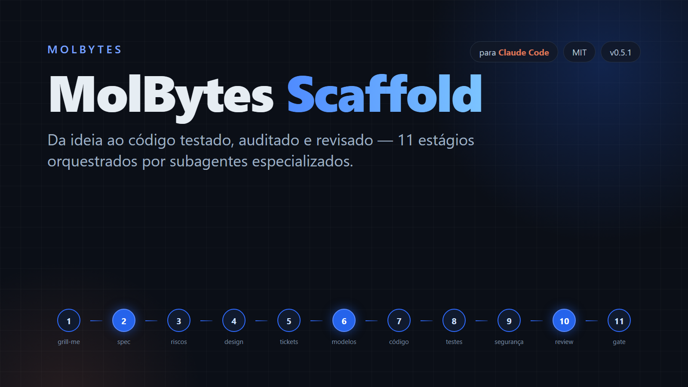

# MolBytes.Scaffold



> Por [MolBytes](https://www.molbytes.io) · criado por Roberto Molina


Skill para o [Claude Code](https://claude.com/claude-code) que leva um projeto
de software da ideia ao código testado, auditado e revisado, em 11 estágios.

Uma sessão principal atua como **orquestrador**: conversa com você, delega cada
estágio a um subagente especializado com o modelo certo (haiku, sonnet ou opus),
confere o resultado e faz commit. Ela mesma não escreve código de produção.

## Pipeline

| # | Estágio | Subagente | Saída | Pausa para você |
|---|---------|-----------|-------|-----------------|
| 1 | grill-me | sessão principal | `.project/qa.json` | conversa |
| 2 | spec + modelo de ameaças | `scaffold-architect` | `.project/spec.md` | **aprovar spec** |
| 3 | riscos, dívida técnica, requisitos de segurança | `scaffold-architect` | `.project/risks.yaml` | — |
| 4 | design | `scaffold-designer` | `.project/design/` | — |
| 5 | tickets | `scaffold-planner` | `.project/tickets.yaml` | — |
| 6 | roteamento de modelos e ondas | `scaffold-router` | `.project/agent-map.json` | **aprovar plano e custo** |
| 7 | implementação paralela por ondas | `scaffold-implementer` | código | — |
| 8 | testes de integração | `scaffold-tester` | `tests/integration/` | — |
| 9 | segurança: audit → triage → fix → verify | `scaffold-security` + `scaffold-implementer` | `.project/security/` | achados médios |
| 10 | code review | `scaffold-reviewer` | `.project/code-review-report.md` | **decidir correções** |
| 11 | testes finais + rescan + gate | sessão principal | `.project/pipeline-report.md` | se bloquear |

## Destaques

- **Retomável:** `state.md` + git são a fonte da verdade. Depois de
  `/compact` ou numa sessão nova, digite `continuar`.
- **Alteração de sistema existente:** a skill procura a documentação do
  sistema (no projeto ou fora) e a atualiza junto com o código; sem
  documentação, só altera o sistema.
- **Documentos fora do projeto, se quiser:** spec, design e relatórios ficam em
  `.project/` ou numa pasta separada com git próprio, para não sujar o projeto
  do cliente. Ver [INSTALL.md](INSTALL.md#onde-ficam-os-documentos).
- **Paralelismo sem conflito:** tickets da mesma onda nunca tocam os mesmos
  arquivos; um ticket `INFRA-000` prepara estrutura, testes e dependências antes
  de tudo.
- **Roteamento de modelo por ticket:** pagamentos, auth, sync offline e
  concorrência vão para opus; config e CRUD trivial para haiku; o resto sonnet.
  Escala automaticamente quando os testes falham.
- **Segurança em duas pontas:** modelo de ameaças e requisitos testáveis antes
  do código; gitleaks, semgrep e trivy (via Docker) + revisão OWASP depois. Toda
  correção começa por um teste que reproduz a falha e é verificada por outro
  agente.
- **Watchdog:** `maxTurns` por subagente, orçamento de tempo em
  `.project/runs.log`, comando `status` a qualquer momento.
- **Sem números inventados:** relatórios só com o que testes e ferramentas
  mostraram.

## Uso rápido

Instale como plugin no Claude Code:

```
/plugin marketplace add rmolinajr/MolBytes.Scaffold
/plugin install molbytes@molbytes
```

E rode:

```
/molbytes:molbytes-scaffold Sistema PDV para restaurante: terminal, cozinha, admin, offline-first, Stripe e PIX
```

Flags no texto do pedido: `--ate <estágio>`, `--sem-design`, `--economico`.

Outras formas de instalar e pré-requisitos (Docker): [INSTALL.md](INSTALL.md). Histórico: [CHANGELOG.md](CHANGELOG.md).

## Estrutura

```
.claude-plugin/
  plugin.json                   # manifesto do plugin (autor, versão, licença)
  marketplace.json              # permite instalar com /plugin
skills/molbytes-scaffold/
  SKILL.md                      # orquestrador
  references/
    stages.md                   # instruções de cada estágio
    model-routing.md            # qual modelo em cada estágio/ticket
    security.md                 # ameaças, código seguro, auditoria, rescan
    watchdog.md                 # limites, orçamento de tempo, reexecução
    state-template.md           # modelo do .project/state.md
    documentos.md               # pasta de documentos: interna ou externa
    alteracao.md                # alteração de sistema existente e sua documentação
agents/
  scaffold-*.md                 # 8 subagentes
```

## Status

v0.8, ainda não validada numa execução completa. Não substitui um pentest
profissional antes de processar pagamentos reais.

## Autor

Criado por **Roberto Molina**, fundador da **MolBytes**.

- Site: [www.molbytes.io](https://www.molbytes.io)

## Suporte e contato

Dúvidas, sugestões ou uso em empresa: fale com a MolBytes pelo site
[www.molbytes.io](https://www.molbytes.io).

## Licença

[MIT](LICENSE) — livre para usar, modificar e distribuir, mantendo o aviso de
copyright da MolBytes.
